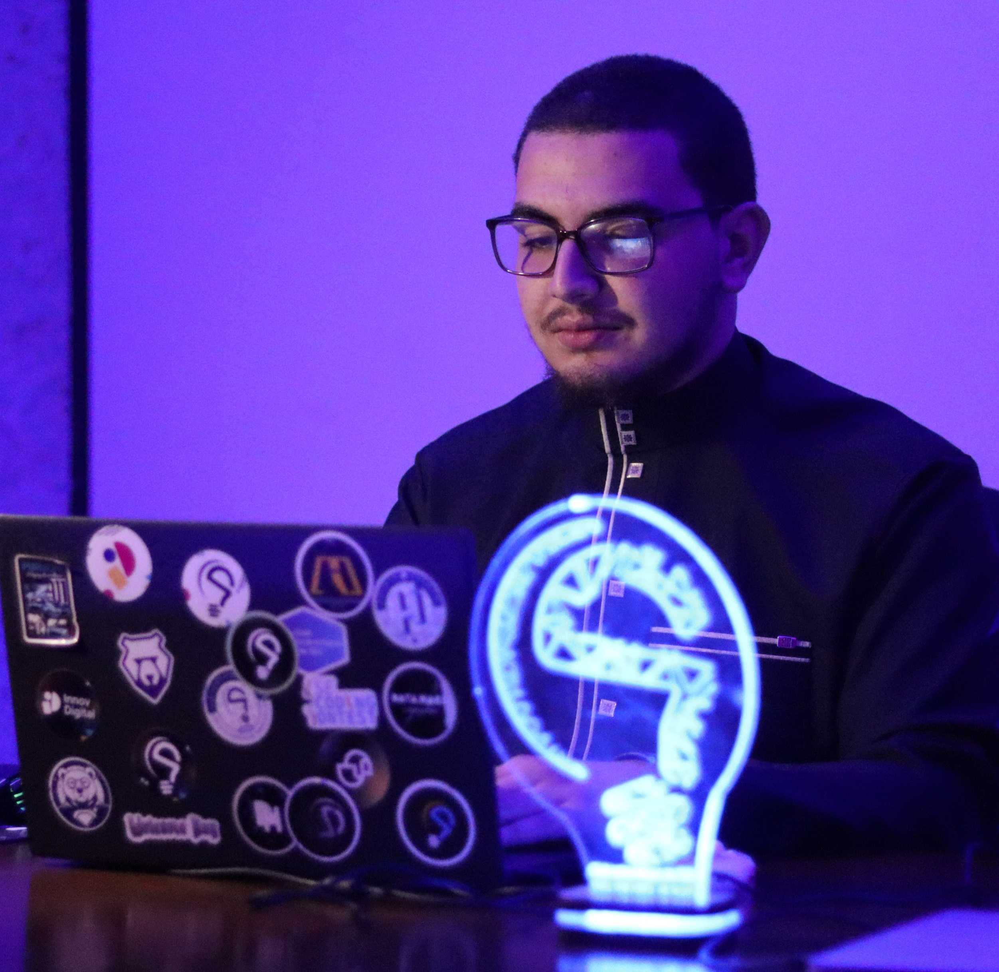

  

<table border="0">
  <tr>
    <td width="35%" align="center" valign="middle">
      
    </td>
    <td width="65%" valign="middle">
      <h2>Oussama Kafif</h2>
      
<b>Mobile Developer (Flutter / iOS / Android) • Cybersecurity Student at USTHB</b> 
      📍 Algiers, Algeria 🇩🇿

      

        
        
      

    </td>
  </tr>
</table>

---

### 🖐️ About me

I'm a Mobile Developer specializing in **Flutter & Dart**, currently studying **Cybersecurity Engineering at USTHB**. I build clean, performant cross-platform applications connected to modern backends like **Supabase & Firebase**.

* 📱 **Mobile Focus** — Designing and shipping smooth, user-centric mobile applications.
* 🚀 **Leadership & Management** — Former **Relev (External Relations & Events) Manager at CSE**, leading tech event logistics, external partnerships, and hackathons.
* 🔐 **Security Mindset** — Combining software development with a solid foundation in cybersecurity and Row Level Security (RLS).
* 💼 **Open to Work** — Available for **Remote Mobile Developer** roles.

 

| 📱 3+ | 🔐 100% | 🎯 5+ | 👥 1,000+ |
| :-: | :-: | :-: | :-: |
| **Mobile Apps** | **Security Focused** | **Major Events Led** | **Students & Attendees Impacted** |

---

### 🎯 Right now

* 📱 Building **Masarif (مصاريف)** — A cross-border family budget tracker (Algeria 🇩🇿 / Saudi Arabia 🇸🇦) with Flutter & Supabase.
* 📚 Developing **USTHB Docs** — A multi-role document sharing platform for university students.
* 🛡️ Deepening my expertise in **Cybersecurity & Cloud Security** at USTHB.

---

### 🛠️ Featured work

| Project | What it is | Stack | Status | Links |
| :--- | :--- | :--- | :--- | :--- |
| **Masarif (مصاريف)** | Cross-border family budget & expense tracker (DZD/SAR) with dynamic currency conversion & Supabase RLS. | Flutter • Supabase • PostgreSQL |  | [Repo](https://github.com/oussamakafif/masarif) |
| **DataHack App** | Mobile app built solo to run CSE's flagship hackathon end-to-end with real-time Firebase syncing. | Flutter • Firebase Auth • Firestore |  | [Repo](https://github.com/oussamakafif/Organizer-App-DH) |
| **USTHB Docs** | Multi-platform document sharing system for university students with a 3-role permission engine. | Flutter • Supabase • PostgreSQL • React |  | [Repo](https://github.com/oussamakafif/USTHB-SRC) |
| **Gestion des Médias** | Console media management system for Movies, TV Series, and Documentaries[cite: 27, 28, 31, 32]. | Java • Object-Oriented Programming |  | [Repo](https://github.com/oussamakafif/Gestion-des-Media-JAVA) |

---

### 💼 Leadership & Event Management Experience

#### 🔹 Club Scientifique de l'ESI (CSE) *(Aug 2024 – Aug 2026)*

* 📌 **Manager of External & Event Relations (Relev)**
  * **DataHack** — Led event operations and sponsorship coordination for CSE's flagship hackathon in partnership with *Yalidine El Djazair Service*.
  * **ICT AFRICA SUMMIT** — Represented CSE as part of the official organizing team.
  * **SkillBoost** — Coordinated our premier external event connecting passionate speakers with students through technical workshops.
  * **HackIN & DevSprint** — Supervised event logistics and execution across student-led tech competitions.
  * **ESMS Onboarding** — Served on the jury panel for new department members and project pitches.

* 📌 **Workshop Instructor / Speaker — CSE Around Algeria (CAA)**
  * Led the **Intro to C Programming** workshop at *École Tusna in Béjaïa*, teaching syntax, memory management, and practical coding skills to motivated students.

* 📌 **Sponsoring & External Relations Member** *(Sep 2024 – Aug 2025)*
  * Managed sponsor outreach, partnership negotiations, and logistical operations across multiple club initiatives.
  * Co-organized **VisualHack**, an internal Graphic Design & UI/UX hackathon.

---

### 🧰 Tech stack

  

---

